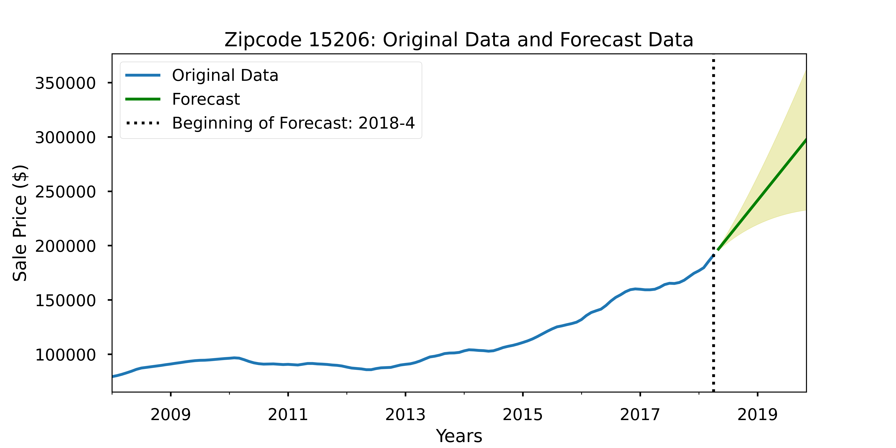
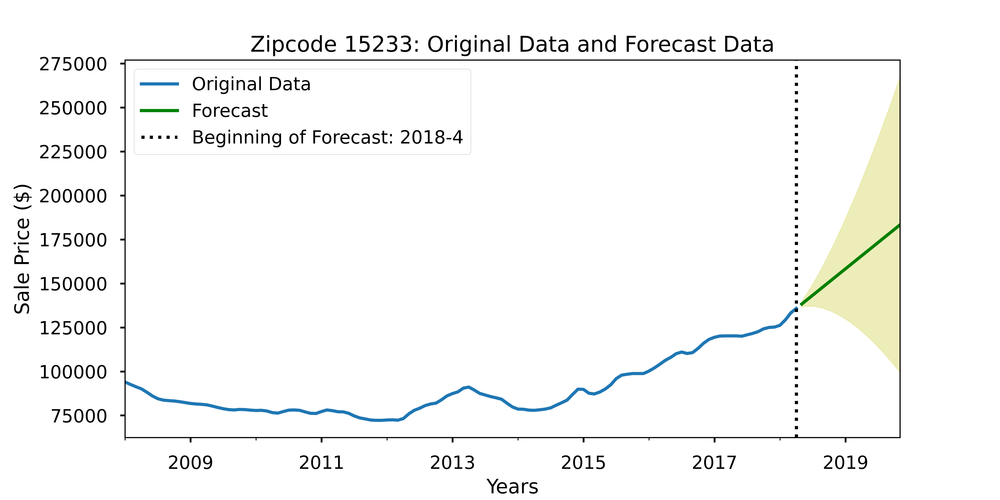
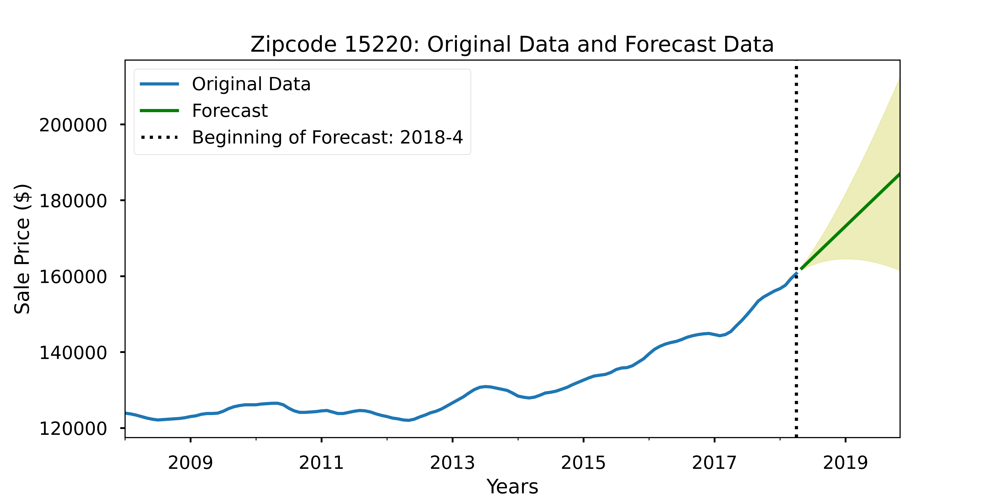
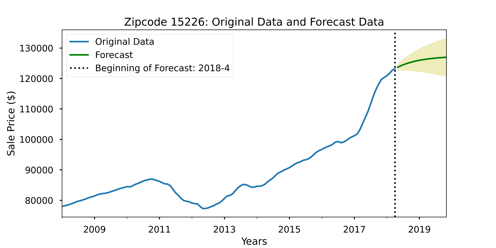

# **Best of the 'Burgh**
## *Forecasting House Sales in Pittsburgh, PA*

**Author**: Ben McCarty

## Overview


If a home buyer is interested in buying a house as a short-term investment (selling within 1.5-2 years)  they want to maximize their return on investment while minimizing the risk of losing money. Given a prospective buyer interested in the Pittsburgh area, they would need to know what areas are showing the strongest growth in terms of sale prices to make their decision.

Using Zillow data from 2008-2018, I forecasted sale prices and calculated the return on investment (ROI) for 19 zip codes in the Pittsburgh area. I utilized time series modeling techniques to analyze price trends over the ten-year period, then forecasted prices for the next 16 months.

The results showed three neighborhoods with both the top ROI and lowest risk of losing money. Furthermore, I identified two additional recommendations with high ROIs and two with lower risks. I recommend focusing on the top three zipcodes for best results; the additional recommendations either include a high risk of losing money or poor expected ROI.

---

## Business Problem

Knowing expected ROIs and potential risks for different neighborhoods is critical for a buyer intending to sell in a short period of time. Buyers would need to know the housing markets for each zip code, especially how the prices are trending into the future.

 In order to provide this information, I forecasted prices based on prior house sales. Once I had the forecasted data, I calculated the ROI based on the initial and final forecasted prices. Once I had the ROI, I determined the risk as the lowest value for my forecast for each zip code.

---

## Data

The selected house sale data is sorced from Zillow for the range of years from 2008 to 2018. I chose to focus on 19 zip codes in Pittsburgh, PA, with prices broken down monthly from May 2008 to April 2018.

---
## Methods

For my analysis, I used time series modeling to forecast prices. The forecast length was determined by number of months used to develop each zip code's model, setting the forecast range equal to the smallest number of months used for tesing my model's performance. In my project, the forecast range focused on 16 months. This choice ensured the forecasts would be evaluated at the same point, regardless of total length of forecast per zip code.

Determining the initial and final forecast prices enabled me to calculate the ROI values. I calculated the ROI as the percentage of difference between the final and initial house pricing for each zip code. The resulting ROI values could be either positive or negative, indicating areas of potentially high or low returns, respectively. Using the forecast's confidence interval, I defined "risk" as the lower confidence interval (representing lowest forecasted ROI).

---
## Results

Most of the forecasts' initial results (generated for testing the model's performance) closely approxmiated the actual data, indicating strong model performances. A few models required fine-tuning to bring forecasts closer to ideal performance. Despite the fine-tuning, two or three model forecasts turned out poorly due to signficant variations in the data. These models would not be very accurate without further fine-tuning beyond this project.

Below are the visualizations of the forecasted results for the top three zip codes, as well as the results for the two other high-ROI models and the two low-risk zip codes.

### Top Three Zip Codes - Highest ROI, Lowest Risk

#### 15206 - East Liberty


#### 15201 - Lawrenceville


#### 15212 - North Shore


### 4th- and 5th-Highest Zip Codes by ROI

#### 15233 - Allegheny West


#### 15207 - Hazelwood


### 4th- and 5th-Highest Zip Codes by Lowest Risk

#### 15220 - Greentree


#### 15226 - Brookline


---
## Conclusions

* Best choices overall would be:
    * 15206 - East Liberty, 43% ROI, 17% Risk
    * 15201 - Lawrenceville 39% ROI,  17% Risk
    * 15212 - North Shore, 29% ROI, 4% Risk

* Additional high-ROI zip codes (with higher risk):
    * 15233 - Allegheny West, 27% ROI, -20% Risk
    * 15207 - Hazelwood, 20% ROI, -19% Risk

* Additional low-risk zip codes:
    * 15220 - Greentree, 13% ROI,  .6% Risk
    * 15226 - Brookline, 3% ROI, -2% Risk


Limitations and Future Work:

* Data ranges from 2008 - 2018
    * Would benefit from more up-to-date data
        * Could evaulate forecasts against actuals
        * Create new forecasts based on new data
* Further tuning of the forecast range may result in better results for the poorly-performing zipcodes.
* Including additional outside factors
    * Planned large-scale projects (infrastructure development; construction/developments)

---
## For More Information

Please review the full analysis in [the Jupyter Notebook](./Best_of_the_Burgh_Notebook.ipynb) or the [presentation](./P4P_Best_of_the_Burgh.pdf).

For any additional questions, please contact at:

**Ben McCarty**

* Email: [bmccarty505@gmail.com](mailto:bmccarty505@gmail.com)

* LinkedIn: [bmccarty505](http://www.linkedin.com/in/bmccarty505)

* GitHub: [github.com/BenJMcCarty](http://www.github.com/BenJMcCarty)

---
## Repository Structure

```
├── README.md                           
├── Best_of_the_Burgh_Notebook.ipynb
├── P4P_Best_of_the_Burgh.pdf
├── data
└── img
```
